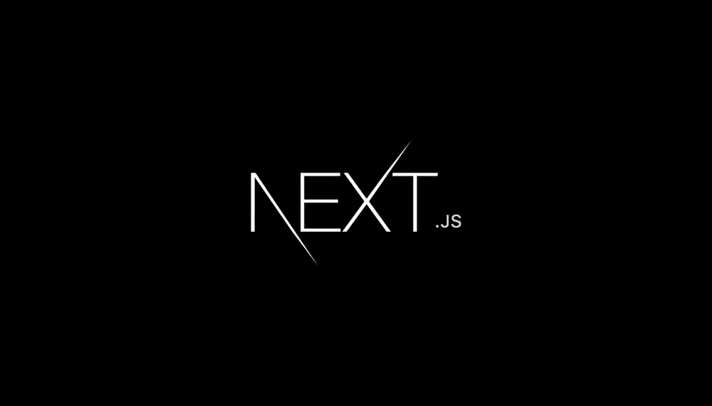

<p style="text-align: center;">
    
    <br />
    <a href="https://vercel.com"></a>
    <a href="https://www.typescriptlang.org"></a>
    <a href="https://nextjs.org"></a>
    <a href="https://ui.shadcn.com"></a>
    <a href="https://tailwindcss.com"></a>
    <a href="https://www.sanity.io"></a>
    <a href="https://stripe.com/en-my"></a>
</p>

# Drip

E-commerce platform built entirely in TypeScript, leveraging NextJS, shadcn/ui
components, TailwindCSS for styling, Sanity.io for CMS, and Stripe for payment
integration.

## Project Overview

-   **Framework:** [NextJS 14](https://nextjs.org)
-   **Component Library:** [shadcn/ui](https://ui.shadcn.com)
-   **Styling:** [TailwindCSS](https://tailwindcss.com)
-   **Content Management:** [Sanity.io](https://sanity.io)
-   **Payment Integration:** [Stripe](https://stripe.com/)
-   **Deployment:** Hosted on [Vercel](http://vercel.com)

Note: This project is predominantly focused on frontend development with minimal
backend setup. Take note of the file /config/inventory.ts, which serves as a
database. Additionally, the file /lib/seed.ts functions as a backend process for
updating the list of products within the CMS.

## Project Status

While the platform is already functional, there are a few areas that needs to be
improved such as:-

-   Improving the user flow in terms of adding product variants.
-   Implementing a backend with database for storing products.
-   Implementing logic for keeping track of stocks.
-   Other common features within an e-commerce web application.

## Getting Started

1. Clone the repo:
    ```git
    git clone git@github.com:mrarvind90/drip.git
    ```
2. Navigate to the repository:
    ```shell
    cd <repository_directory>
    ```
    Change <repository_directory> to the name of the cloned directory.
3. Install Dependencies:
    ```shell
    pnpm install
    ```
    This command will install all the necessary dependencies for the
    application.
4. Configure Environment Variables: Rename the `.env.sample` file in your
   project directory to `.env` and update it with the relevant credentials:
    ```shell
     cp .env.sample .env
    ```
5. Run the application:
    ```shell
     pnpm dev
    ```
6. Launch the application on http://localhost:3000/

## License

This project is licensed under the [MIT License](./LICENSE).

## Acknowledgments

Built with inspiration from the comprehensive tutorial by
[@code.bootcamp](https://www.youtube.com/@code.bootcamp). Check out the full
tutorial:
[Full Stack E-Commerce App with Next 13, React, Sanity, Stripe, & TailwindCSS](https://www.youtube.com/watch?v=g2sE034SGjw&list=PLQ0mXHAlMS_XMQ8ng9jjO-JUeP_Z6rDpa&index=33&t=1019s).
